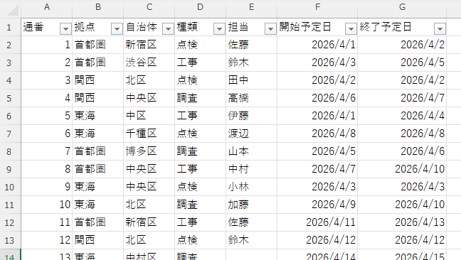
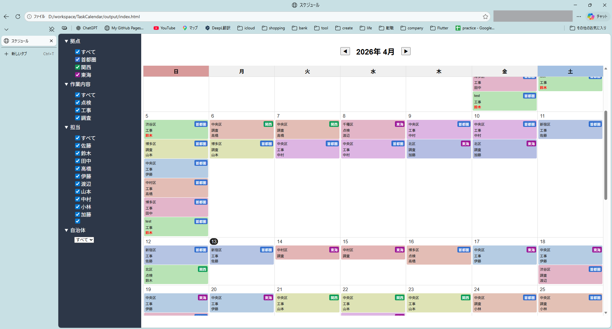

# スケジュールHTML生成

---

## 1. 概要

本ツールは、Excelで管理しているタスク情報を元に、  
Webブラウザ上で閲覧可能なカレンダー形式のHTMLを生成するものである。  
**本リポジトリのコードは生成AIを利用してベースを作成し、ハンドコードで詳細を仕上げている。**

---

## 2. 仕様

### インプットとするエクセルデータ
| 列番号 | 列名 | 内容 |
|------|------|------|
| 1 | 通番 | タスクID |
| 2 | 拠点 | 首都圏 / 東海 / 関西 |
| 3 | 自治体 | 市区町村 |
| 4 | 作業内容 | 作業う内容 |
| 5 | 担当 | 作業担当者 |
| 6 | 開始予定日 | YYYY/MM/DD |
| 7 | 終了予定日 | YYYY/MM/DD |

[サンプル]  

### 生成されるカレンダー（ビュー）
- 絞り込み機能付きのカレンダー。月単位の表示で、表示時には当日の日付まで自動スクロールされる。
- 表示されるタスクには、エクセル上で非表示となっているものは含まれない。
- 当日のタスクが複数ある作業者は名前を赤色表示する。
- タスクをクリックすることで、タスクの詳細情報を表示する。

[サンプル]  

### アーキ
- VBAから、以下の情報を含むHTML（`index.html`）を生成。
  - ヘッダ
  - タスクの絞り込みフィルタ
  - タスクの情報を保持する配列データ
- `index.html`の読み込み時に`script.js`を呼び出し、`script.js`が`index.html`内の配列データからカレンダーのDOMを構成する。

---

## 3. 使用方法
### 事前準備
1. 本リポジトリをダウンロードする。
2. 1でダウンロードした`CalendarVBA`をローカルの`C:\work\`に配置する。
3. `tasks.xlsm`に登録されているサンプルタスクを削除し、必要なタスクを登録する。

### 使用方法
1. `tasks.xlsm`を開き、`ExportScheduleToHTML`マクロを実行する。
2. `index.html`をブラウザで開く。
3. タスク更新時は、再度`ExportScheduleToHTML`マクロを実行し、ブラウザで`index.html`をリロードする。
